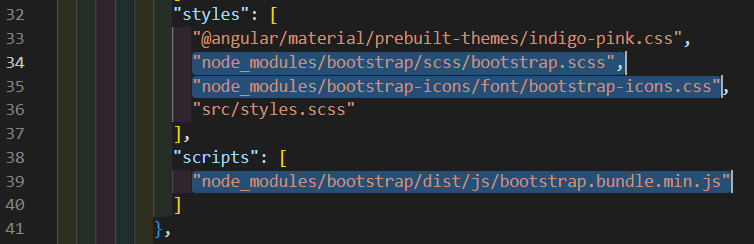

# Angular_study

### ติดตั้ง Angular 
    npm install -g @angular/cli
### สร้าง file
    ng new my-app 
### คำสั่ง run
    run (ng serve --open)


### ติดตั้งเพิ่มเติม
```
#bootstrap 
npm i bootstrap
#bootstrap, bootstrap-icons
npm i bootstrap bootstrap-icons

#material.angular.io
ng add @angular/material

#APIs
npm install json-server
```

# file
### my-app
- CSS
- bootstrap

### study1
- bootstrap, bootstrap-icons
>`angular.json`


- material.angular.io
```
[click](https://youtube.com/playlist?list=PLp50dWW_m40W6u4NxWCsQk1F8CmzBI6r0&si=H2q8JabC6njtTsyC)
```
